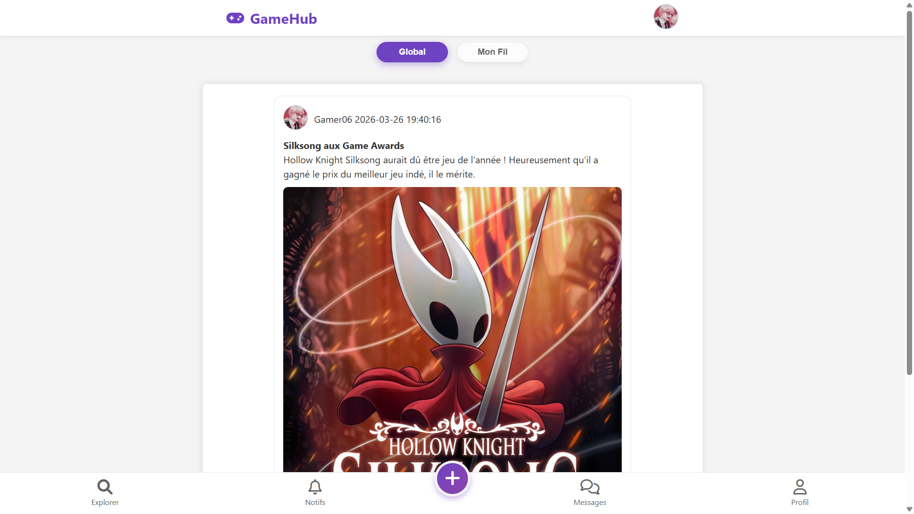
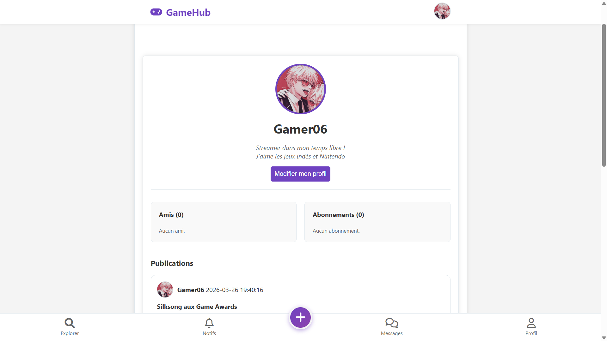

# 🎮 GameHub - Réseau Social pour Gamers

GameHub est un réseau social moderne dédié aux passionnés de jeux vidéo. Les utilisateurs peuvent partager leurs posts, voter, commenter, se faire des amis et suivre d'autres joueurs.

## 📋 Table des matières

- [Architecture](#architecture)
- [Installation](#installation)
- [Fonctionnalités principales](#fonctionnalités-principales)
- [Guide d'utilisation](#guide-dutilisation)
- [Guide d'administration](#guide-dadministration)
- [Structure du projet](#structure-du-projet)
- [Modèle de données](#modèle-de-données)

---

## 🏗️ Architecture

GameHub utilise une architecture **MVC (Model-View-Controller)** avec PHP et MySQL :

- **Frontend** : HTML/CSS avec design responsive et thème sombre/clair
- **Backend** : PHP avec PDO (base de données)
- **Base de données** : MySQL

### Stack technique
- PHP 7.4+
- MySQL 5.7+
- CSS3 + FontAwesome 6.0
- JavaScript vanilla

---

## 💻 Installation

### Prérequis
- PHP 7.4 ou supérieur
- MySQL 5.7 ou supérieur
- Un serveur web (Apache, Nginx, etc.)

### Étapes

1. **Cloner le projet**
```bash
git clone https://github.com/Yukina-Shiro/projet_gamehub
cd sae_s301_projet_gamehub/src
```

2. **Configurer la base de données**
   - Modifiez [config/db.php](src/config/db.php) avec vos identifiants MySQL
   - Créez la base de données `gamehub_db`
   - Il suffit d'importer le fichier `database.sql` dans phpMyAdmin

3. **Créer le dossier uploads**
```bash
mkdir uploads
chmod 755 uploads
```

4. **Accéder à l'application**
```
http://localhost/sae_s301_projet_gamehub/src/index.php
```

### Comptes de démonstration

Afin de faciliter les tests et la démonstration de l'application, des utilisateurs sont déjà présents dans la base de données.

#### Compte Administrateur
- **Email** : Admin@admin.com
- **Mot de passe** : 1234
- **Rôle** : Administrateur (accès au panneau d'administration)

#### Compte Utilisateur (Lambda)
- **Email** : gamer06@test.com
- **Mot de passe** : 1234
- **Rôle** : Utilisateur standard

---

## ✨ Fonctionnalités principales

### 👤 Authentification
- **Inscription** : Créer un compte avec pseudo, email et mot de passe haché
- **Connexion** : Accès sécurisé à l'application
- **Profil** : Modifier photo, bio, pseudo, nom et prénom

### 📝 Posts
- **Créer** : Partager un post avec titre, description et image optionnelle
- **Visibilité** : Public ou Amis seulement
- **Modifier/Supprimer** : Gérer ses propres posts
- **Voter** : Liker 👍 ou Disliker 👎 les posts

### 💬 Commentaires
- **Commenter** : Réagir aux posts
- **Tri intelligent** : Ordre personnalisé selon vos préférences et amis
  - **Pertinence** : Amis d'abord, puis commentaires alignés avec votre vote
  - **Récent** : Du plus récent au plus ancien
  - **Ancien** : Du plus ancien au plus récent

### 👥 Amitié
- **Demande d'ami** : Envoyer une demande
- **Accepter/Refuser** : Gérer les demandes reçues
- **Liste d'amis** : Voir tous les amis validés

### 📱 Abonnements (Follow)
- **Suivre** : S'abonner aux posts publics d'un utilisateur
- **Ne plus suivre** : Se désabonner
- **Liste d'abonnements** : Voir qui vous suivez

### 🔔 Notifications
- Notifications en temps réel pour :
  - Demandes d'ami
  - Acceptations d'ami
  - Nouveaux posts de vos amis/abonnés
  - Votes sur vos posts
  - Commentaires
- **Marquer comme lue** : Cliquez sur l'icône ✅ pour marquer une notification comme vue
- **Marquer tout comme vu** : Cliquez sur le bouton violet en haut de la page pour marquer toutes les notifications comme lues en un seul clic
- **Badge de notification** : Compteur de notifications non lues
- **Suppression** : Cliquez sur ❌ pour supprimer une notification

### 💬 Messages (Chat)
- **Conversation privée** : Discuter avec les amis
- **Partage de post** : Envoyer un lien vers un post
- **Badge de message** : Compteur de messages non lus
- **Messages marqués lus** : Historique des conversations

### 🎨 Interface
- **Mode sombre/clair** : Toggle en paramètres (sauvegardé en localStorage)
- **Navigation intuitive** : Barre de navigation fixe avec menu utilisateur
- **Design responsive** : Optimisé pour mobile et desktop

### 🔍 Recherche
- **Chercher des utilisateurs** : Par pseudo
- **Explorer** : Découvrir de nouveaux joueurs

### ❓ FAQ
- Questions fréquentes sur l'application

### 🛡️ Administration
- **Panneau d'administration** : Accès réservé aux administrateurs
- **Gestion des utilisateurs** : Voir la liste des utilisateurs actifs
- **Bannissement** : Bannir un utilisateur pour violation des règles
- **Débannissement** : Restaurer l'accès à un utilisateur banni
- **Statut utilisateur** : Consulter les utilisateurs actifs, bannissements en cours, etc.

---

## 📖 Guide d'utilisation

### Créer un post

1. Cliquez sur le bouton **+** en bas au centre (FAB)
2. Remplissez :
   - **Titre** (optionnel)
   - **Description** (requis)
   - **Image** (optionnelle)
   - **Visibilité** (Public / Amis seulement)
3. Cliquez sur **Publier**

### Voter sur un post

- **👍 Like** : Cliquez pour voter positivement
- **👎 Dislike** : Cliquez pour voter négativement
- **Cliquer deux fois** : Annule votre vote

### Commenter un post

1. Ouvrez un post (cliquez dessus)
2. Entrez votre commentaire dans le formulaire
3. Appuyez sur **Envoyer**

**Astuce** : Les commentaires se trient intelligemment selon votre vote et vos amis !

### Ajouter un ami

1. Visitez le profil de l'utilisateur
2. Cliquez sur **Ajouter en ami**
3. L'utilisateur recevra une notification
4. Il peut accepter ou refuser
5. Une fois acceptée, vous devenez amis

### Suivre un utilisateur

1. Visitez le profil
2. Cliquez sur **Suivre**
3. Vous recevrez les notifications de ses nouveaux posts publics
4. L'utilisateur est notifié que vous le suivez

### Gérer vos notifications

1. Cliquez sur l'icône 🔔 en haut à droite
2. **Marquer comme vu** : Cliquez sur ✅ à côté d'une notification
3. **Marquer tout comme vu** : Cliquez sur le bouton violet en haut
4. **Supprimer** : Cliquez sur ❌ pour supprimer une notification

### Gérer vos paramètres

1. Cliquez sur votre avatar en haut à droite
2. Sélectionnez **Paramètres**
3. Activer/Désactiver le **Mode Sombre**

### Modifier votre profil

1. Accédez à votre profil
2. Cliquez sur **Modifier mon profil**
3. Mettez à jour vos informations
4. Sauvegardez

---

## 🛡️ Guide d'administration

### Accéder au panneau d'administration

1. Connectez-vous avec un compte administrateur
2. Cliquez sur votre avatar en haut à droite
3. Sélectionnez **Administration** (si vous avez les permissions)
4. Vous accédez au tableau de bord

### Gérer les utilisateurs

1. Dans le panneau d'administration, allez dans **Gestion des utilisateurs**
2. Vous voyez la liste de tous les utilisateurs avec leur statut :
   - 🟢 **Actif** : Compte normal
   - 🔴 **Banni** : Compte suspendu
   - ⏱️ **Bannissement temporaire** : Compte banni jusqu'à une date spécifique

### Supprimer un utilisateur :

 - L'administrateur peut supprimer définitivement un compte ne respectant pas les règles, ce qui supprimera également tous ses posts et commentaires.

**Raisons courantes :**
- Contenu inapproprié
- Harcèlement
- Spam
- Violation des conditions d'utilisation

### Modifier les rôles utilisateurs

1. Accédez à la fiche utilisateur
2. Cliquez sur **Modifier le rôle**
3. Choisissez entre :
   - **User** : Utilisateur normal
   - **Admin** : Administrateur (accès au panneau d'administration)
4. Validez

---

## 📁 Structure du projet

```
sae_s301_projet_gamehub/
├── src/
│   ├── index.php                 # Point d'entrée (Routeur)
│   ├── style.css                 # Styles globaux
│   ├── config/
│   │   └── db.php                # Configuration base de données
│   ├── controllers/
│   │   ├── Controller.php         # Classe mère
│   │   ├── AuthController.php     # Authentification
│   │   ├── HomeController.php     # Accueil & FAQ
│   │   ├── UserController.php     # Profils & amitié
│   │   ├── PostController.php     # Posts & votes
│   │   ├── ChatController.php     # Messages
│   │   ├── NotificationController.php  # Notifications
│   │   └── AdminController.php    # Administration & bannissement
│   ├── models/
│   │   ├── Model.php             # Classe mère
│   │   ├── UserModel.php         # Gestion utilisateurs
│   │   ├── PostModel.php         # Gestion posts
│   │   ├── VoteModel.php         # Gestion votes
│   │   ├── CommentModel.php      # Gestion commentaires
│   │   ├── FriendModel.php       # Gestion amitié
│   │   ├── FollowModel.php       # Gestion abonnements
│   │   ├── ChatModel.php         # Gestion messages
│   │   └── NotificationModel.php # Gestion notifications
│   ├── views/
│   │   ├── auth/
│   │   │   ├── login.php         # Connexion
│   │   │   └── register.php      # Inscription
│   │   ├── user/
│   │   │   ├── profile.php       # Profil utilisateur
│   │   │   ├── edit.php          # Éditer profil
│   │   │   ├── search.php        # Recherche utilisateurs
│   │   │   └── settings.php      # Paramètres
│   │   ├── admin/
│   │   │   ├── dashboard.php     # Tableau de bord
│   │   │   └── users.php         # Gestion utilisateurs
│   │   ├── chat/
│   │   │   ├── index.php         # Liste conversations
│   │   │   └── conversation.php  # Conversation
│   │   ├── notification/
│   │   │   └── index.php         # Notifications
│   │   ├── layout/
│   │   │   ├── header.php        # En-tête
│   │   │   └── footer.php        # Pied de page
│   │   ├── home.php              # Fil d'actualité
│   │   ├── post_detail.php       # Détail post
│   │   ├── post_edit.php         # Éditer post
│   │   └── faq.php               # FAQ
│   └── uploads/                  # Photos de profil & posts
└── README.md                     # Cette documentation
```

---

## 🗄️ Modèle de données

### Utilisateur
```
- id_utilisateur (PK)
- pseudo
- email
- mdp (haché)
- nom, prenom
- bio
- photo_profil
- date_naissance
- role (user, admin)
- statut (actif, banni)
- date_ban (nullable)
- raison_ban (nullable)
```

### Post
```
- id_post (PK)
- id_utilisateur (FK)
- titre
- description
- photo
- statut (public, ami)
- date_creation
```

### Vote
```
- id_utilisateur (FK)
- id_post (FK)
- vote (1=like, -1=dislike)
```

### Commentaire
```
- id_commentaire (PK)
- id_utilisateur (FK)
- id_post (FK)
- commentaire
- date_com
```

### Ami
```
- id_utilisateur1 (FK)
- id_utilisateur2 (FK)
- statut (attente, valide)
```

### Relation (Follow)
```
- suiveur (FK)
- suivi (FK)
```

### Message
```
- id_message (PK)
- id_emetteur (FK)
- id_destinataire (FK)
- contenu
- id_post_partage (FK, optionnel)
- date_envoi
- lu
```

### Notification
```
- id_notif (PK)
- id_destinataire (FK)
- id_emetteur (FK)
- type (demande_ami, comment, vote, etc.)
- message
- date_notif
- lu
```

---

## 🔒 Sécurité

- **Mots de passe** : Hachés avec `PASSWORD_DEFAULT` (bcrypt)
- **Injection SQL** : Protection par prepared statements (PDO)
- **XSS** : Utilisation de `htmlspecialchars()` et `nl2br()`
- **Vérification d'accès** : Contrôle dans les controllers
- **Vérification de rôle** : Seuls les admins accèdent au panneau d'administration

---

## 🚀 Fonctionnalités futures

- [ ] Appels/signalement d'utilisateurs
- [ ] Système de points de réputation
- [ ] Blocage d'utilisateurs personnalisé
- [ ] Notifications en temps réel (WebSocket)
- [ ] Upload de vidéos
- [ ] Badges et achievements
- [ ] Systèmes de groupes
- [ ] Classement global
- [ ] 2FA (Authentification à deux facteurs)

---

## 📸 Aperçu de l'application


*Le fil d'actualité personnalisé.*


*Le profil avec le système d'abonnement et d'amis.*

---

## 🤝 Contribution

Pour contribuer au projet :

1. Créer une branche feature (`git checkout -b feature/ma-feature`)
2. Faire vos modifications
3. Commiter (`git commit -m 'Ajout de ma-feature'`)
4. Pousser (`git push origin feature/ma-feature`)
5. Créer une merge request

---

## 📄 Licence

Ce projet est un projet scolaire (SAE S301). Tous droits réservés.

---

## 📞 Support

Créé par Enora Saunier - [Lien vers mon Portfolio.](https://portfolio-enora-saunier.vercel.app/)


**Happy Gaming! 🎮**